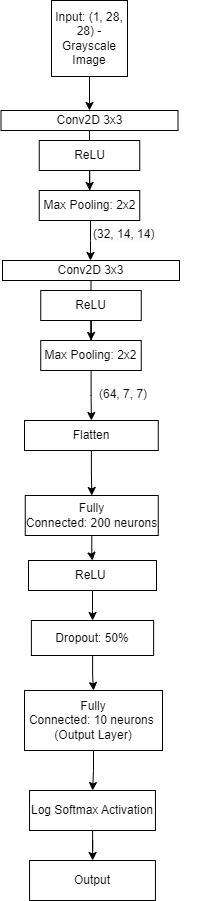
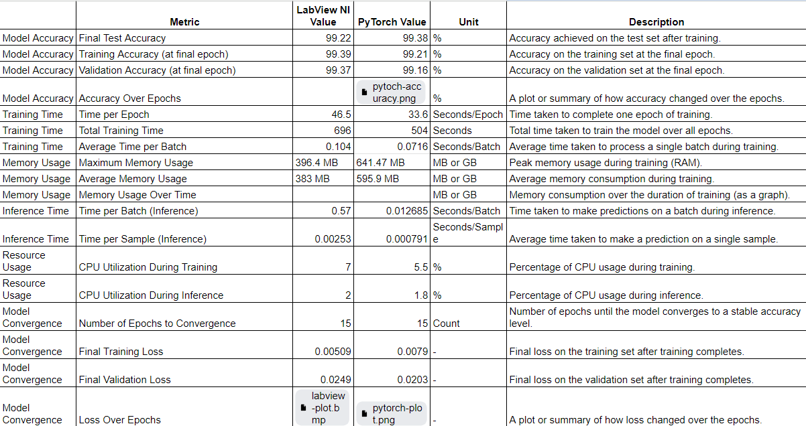
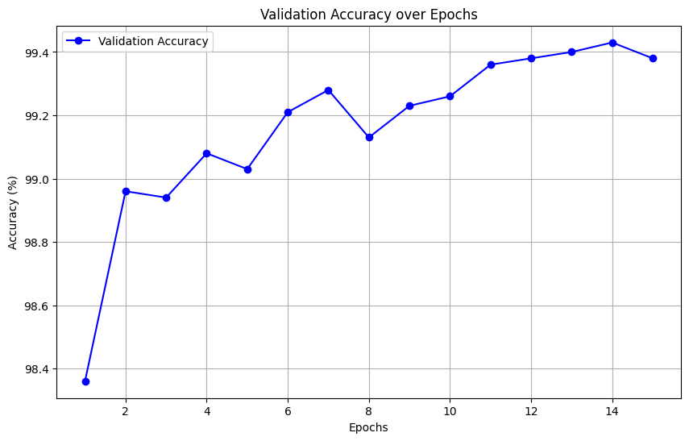

# LabVIEW and PyTorch Comparison

## Description
This project presents a comparison of handwritten digit recognition performance between LabView and PyTorch,  utilizing a Convolutional Neural Network (CNN) model. 

## CNN Architecture

## Comparison Results

## Loss Over Epochs
### PyTorch

### LabView

## Accuracy Over Epochs

"# labview-vs-pytorch" 
