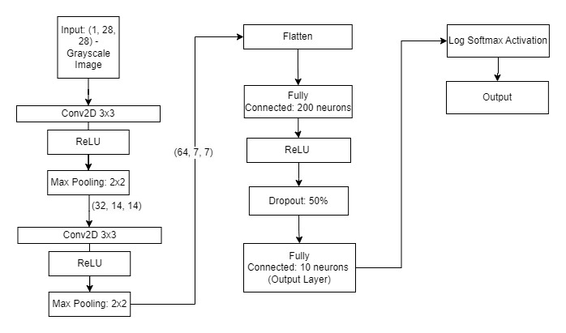
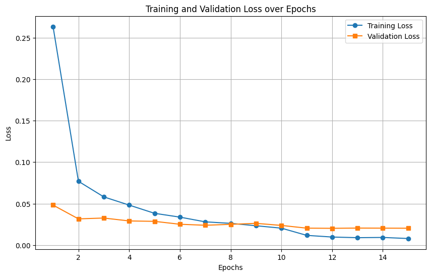
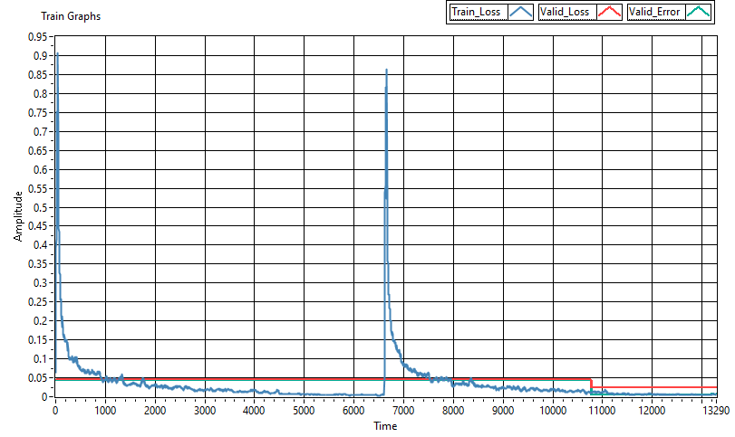
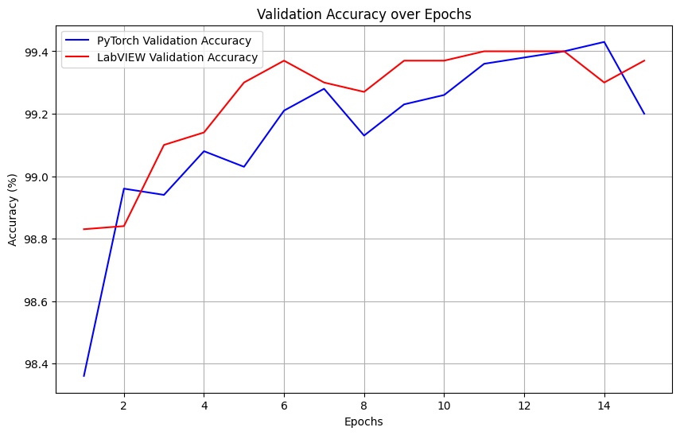

# LabVIEW and PyTorch Comparison

## Description
This project presents a comparison of handwritten digit recognition performance between LabView and PyTorch,  utilizing a Convolutional Neural Network (CNN) model. 

## CNN Architecture

## Comparison Results

Below is a detailed table comparing various metrics between **LabVIEW** and **PyTorch** implementations.

| Metric                       | LabView NI Value | PyTorch Value       | Unit           | Description                                                                                  |
|------------------------------|------------------|---------------------|----------------|----------------------------------------------------------------------------------------------|
| **Model Accuracy**           |                  |                     |                |                                                                                              |
| Final Test Accuracy          | 99.22           | 99.38              | %              | Accuracy achieved on the test set after training.                                            |
| Training Accuracy (at final epoch) | 99.39   | 99.21              | %              | Accuracy on the training set at the final epoch.                                             |
| Validation Accuracy (at final epoch) | 99.37 | 99.16              | %              | Accuracy on the validation set at the final epoch.                                           |
| **Training Time**            |                  |                     |                |                                                                                              |
| Time per Epoch               | 46.5            | 33.6               | Seconds/Epoch  | Time taken to complete one epoch of training.                                                |
| Total Training Time          | 696             | 504                | Seconds        | Total time taken to train the model over all epochs.                                         |
| Average Time per Batch       | 0.104           | 0.0716             | Seconds/Batch  | Average time taken to process a single batch during training.                                |
| **Memory Usage**             |                  |                     |                |                                                                                              |
| Maximum Memory Usage         | 396.4 MB        | 641.47 MB          | MB or GB       | Peak memory usage during training (RAM).                                                     |
| Average Memory Usage         | 383 MB          | 595.9 MB           | MB or GB       | Average memory consumption during training.                                                  |
| **Inference Time**           |                  |                     |                |                                                                                              |
| Time per Batch (Inference)   | 0.57            | 0.012685           | Seconds/Batch  | Time taken to make predictions on a batch during inference.                                  |
| Time per Sample (Inference)  | 0.00253         | 0.000791           | Seconds/Sample | Average time taken to make a prediction on a single sample.                                  |
| **Resource Usage**           |                  |                     |                |                                                                                              |
| CPU Utilization During Training | 7            | 5.5               | %              | Percentage of CPU usage during training.                                                     |
| CPU Utilization During Inference | 2          | 1.8               | %              | Percentage of CPU usage during inference.                                                    |
| **Model Convergence**        |                  |                     |                |                                                                                              |
| Number of Epochs to Convergence | 15           | 15                | Count          | Number of epochs until the model converges to a stable accuracy level.                       |
| Final Training Loss          | 0.00509         | 0.0079             | -              | Final loss on the training set after training completes.                                     |
| Final Validation Loss        | 0.0249          | 0.0203             | -              | Final loss on the validation set after training completes.                                   |

## Loss Over Epochs
The following plots demonstrate the change in model loss over each epoch during training.

### PyTorch Loss Over Epochs

### LabLabView Loss Over EpochsView

## Validation Accuracy Over Epochs - PyTorch vs Labview

